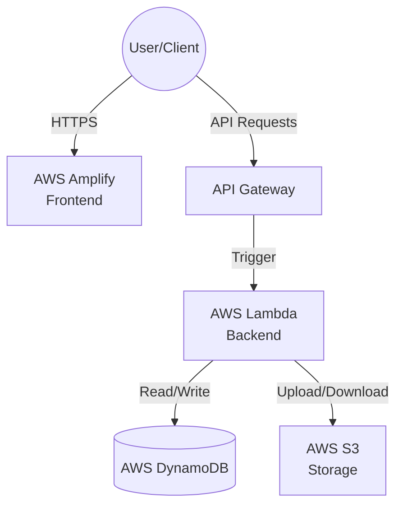

# CampusPulse — Ultimate AWS Deployment Guide (Console Only)

This guide provides the definitive, step-by-step walkthrough for deploying the **CampusPulse** platform from your local environment to a production-ready AWS architecture using **only the AWS Management Console**.

---

## 🏗️ Architecture Overview



| Layer | Service | Purpose |
|-------|---------|---------|
| Frontend | AWS Amplify | React SPA hosting, auto-deploy from GitHub |
| API | API Gateway (HTTP) | Routes `/api/{proxy+}` → Lambda |
| Backend | AWS Lambda (Node.js 20.x) | Express app via `serverless-http` |
| Database | DynamoDB (13 tables, on-demand) | NoSQL, zero server management |
| Storage | S3 | File uploads |

---

## 🚀 Phase 0: Preparation & GitHub Push

Before touching AWS, ensure your codebase is ready and pushed to GitHub.

### 0.1 Prepare the Codebase
Ensure you have the latest production-ready code locally.
1. Verify `.gitignore` includes `.env`, `node_modules/`, `dist/`, `build/`, and `deploy.zip`.
2. Build the deployment package for Lambda locally:
   ```bash
   cd backend
   npm install --production
   npm run package
   ```
   *(This creates `backend/deploy.zip` which we will upload to Lambda later)*

### 0.2 Commit and Push to GitHub
Amplify will pull your frontend directly from your GitHub repository.
```bash
git add .
git commit -m "chore: prepare for production deployment"
git branch -M main
git push -u origin main
```
> **Note:** Ensure your repository is accessible (public or private is fine, Amplify will ask for authorization).

---

## 🗄️ Phase 1: Database Setup (AWS DynamoDB)

All backend data relies on DynamoDB. We need to create the tables first.

### 1.1 Create the DynamoDB Tables
Navigate to **DynamoDB Console** → **Create table**. Create each of the 13 tables below.
**CRITICAL:** Set **Capacity mode** to **On-demand** for all tables.

| # | Table Name | Partition Key | Sort Key |
|---|-----------|---------------|----------|
| 1 | `CampusPulse_Users` | `userId` (String) | — |
| 2 | `CampusPulse_Students` | `studentId` (String) | — |
| 3 | `CampusPulse_Faculty` | `facultyId` (String) | — |
| 4 | `CampusPulse_Departments` | `departmentId` (String) | — |
| 5 | `CampusPulse_Courses` | `courseId` (String) | — |
| 6 | `CampusPulse_Enrollments` | `student_id` (String) | `course_id` (String) |
| 7 | `CampusPulse_RfidCards` | `cardId` (String) | — |
| 8 | `CampusPulse_GateLogs` | `logId` (String) | — |
| 9 | `CampusPulse_LectureSessions` | `sessionId` (String) | — |
| 10 | `CampusPulse_AttendanceRecords` | `session_id` (String) | `student_id` (String) |
| 11 | `CampusPulse_QrTokens` | `tokenId` (String) | — |
| 12 | `CampusPulse_Alerts` | `alertId` (String) | — |
| 13 | `CampusPulse_AuditLogs` | `logId` (String) | — |

### 1.2 Add Global Secondary Indexes (GSIs)
After each table status is **Active**, select the table, go to **Indexes** tab → **Create index**.
**CRITICAL:** Set **Projected attributes** to **All** for every GSI.

| Table | GSI Name | Partition Key | Sort Key |
|-------|----------|---------------|----------|
| `Users` | `EmailIndex` | `email` (S) | — |
| `Users` | `RoleIndex` | `role` (S) | — |
| `Students` | `UserIdIndex` | `user_id` (S) | — |
| `Students` | `GrNumberIndex` | `gr_number` (S) | — |
| `Faculty` | `UserIdIndex` | `user_id` (S) | — |
| `Enrollments` | `CourseIndex` | `course_id` (S) | — |
| `RfidCards` | `RfidUidIndex` | `rfid_uid` (S) | — |
| `GateLogs` | `StudentTimeIndex` | `student_id` (S) | `scanned_at` (S) |
| `GateLogs` | `DateIndex` | `scan_date` (S) | `scanned_at` (S) |
| `LectureSessions` | `DateIndex` | `session_date` (S) | — |
| `LectureSessions` | `CourseIndex` | `course_id` (S) | — |
| `AttendanceRecords` | `StudentIndex` | `student_id` (S) | — |
| `QrTokens` | `TokenIndex` | `token` (S) | — |

---

## ⚡ Phase 2: Backend Deployment (Lambda + API Gateway)

### 2.1 Create IAM Role for Lambda
1. Go to **IAM Console** → **Roles** → **Create role**.
2. **Trusted entity**: AWS Service → **Lambda**.
3. **Add permissions** (Search and attach these policies):
   - `AWSLambdaBasicExecutionRole`
   - `AmazonDynamoDBFullAccess`
   - `AmazonS3FullAccess`
4. **Role name**: `campuspulse-lambda-role`
5. Click **Create role**.

### 2.2 Create the Lambda Function
1. Go to **Lambda Console** → **Create function**.
2. **Function name**: `campuspulse-api`
3. **Runtime**: Node.js 20.x
4. **Execution role**: Choose "Use an existing role" → `campuspulse-lambda-role`.
5. Click **Create function**.

### 2.3 Configure Lambda Settings & Code
1. **Upload code**: Click **Upload from** → **.zip file** → Select `backend/deploy.zip` (created in Phase 0.1).
2. **Runtime settings**: Click Edit. Change **Handler** to `lambda.handler`.
3. **General configuration**: Click Edit. Change **Timeout** to `30 seconds` and **Memory** to `512 MB`.

### 2.4 Configure Environment Variables
In Lambda → **Configuration** → **Environment variables**, click Edit and add:

| Key | Value |
|-----|-------|
| `NODE_ENV` | `production` |
| `DB_MOCK` | `false` |
| `DYNAMODB_TABLE_PREFIX` | `CampusPulse_` |
| `JWT_SECRET` | *(Enter a secure random string, min 32 chars)* |
| `JWT_EXPIRES_IN` | `7d` |
| `CORS_ORIGIN` | `*` *(We will restrict this in Phase 5)* |
| `AWS_S3_BUCKET` | `campuspulse-uploads` *(Matches Phase 3)* |

### 2.5 Create API Gateway
1. Go to **API Gateway Console** → **Create API** → under **HTTP API**, click **Build**.
2. **Integrations**: Click Add integration, choose **Lambda**, select `campuspulse-api`.
3. **API name**: `campuspulse-gateway`. Click Next.
4. **Routes**:
   - Method: `ANY`
   - Resource path: `/api/{proxy+}`
   - Integration target: `campuspulse-api`
5. **Stages**: Leave as `$default` (auto-deploy). Click Next, then Create.
6. **Copy the Invoke URL** (e.g., `https://xyz.execute-api.ap-south-1.amazonaws.com`).

---

## 📂 Phase 3: S3 Storage Setup (File Uploads)

1. Go to **S3 Console** → **Create bucket**.
2. **Bucket name**: `campuspulse-uploads-<your-unique-suffix>` (e.g., `campuspulse-uploads-2026`).
3. **Region**: Must match your Lambda region.
4. Leave "Block all public access" **Checked**.
5. Click **Create bucket**.
6. Select your new bucket → **Permissions** tab → **CORS configuration**. Edit and paste:
   ```json
   [
     {
       "AllowedHeaders": ["*"],
       "AllowedMethods": ["GET", "PUT", "POST", "DELETE"],
       "AllowedOrigins": ["*"],
       "ExposeHeaders": []
     }
   ]
   ```
7. *Return to Lambda → Configuration → Environment variables and update `AWS_S3_BUCKET` if you added a suffix.*

---

## 🎨 Phase 4: Frontend Deployment (AWS Amplify)

### 4.1 Connect to GitHub
1. Go to **Amplify Console** → **New app** → **Host web app**.
2. Select **GitHub** and authorize AWS to access your repositories.
3. Select the **CampusPulse** repository and your target branch (e.g., `main`).

### 4.2 Configure Build Settings & Environment
1. Amplify should auto-detect `amplify.yml`. Click **Advanced settings**.
2. Under **Environment variables**, add:
   - Key: `VITE_API_URL`
   - Value: `https://<YOUR-API-GATEWAY-URL>.amazonaws.com/api` *(Make sure to append `/api` to the Gateway URL)*
3. Click **Next**, then **Save and deploy**. Wait for the build to finish (green checkmarks).

### 4.3 SPA Redirects (CRITICAL)
React relies on client-side routing. We must tell Amplify to route all unknown paths to `index.html`.
1. In Amplify, go to your app settings → **Rewrites and redirects**.
2. Click **Manage redirects** → **Add rewrite**.
3. **Source address**: `</^[^.]+$|\.(?!(css|gif|ico|jpg|js|png|txt|svg|woff|woff2|ttf|map|json)$)([^.]+$)/>`
4. **Target address**: `/index.html`
5. **Type**: `200 (Rewrite)`
6. Click **Save**.

---

## 🔐 Phase 5: Post-Deployment & Validation

### 5.1 Lock Down CORS
Now that Amplify has generated your production URL (e.g., `https://main.d1234.amplifyapp.com`):
1. Go to **Lambda Console** → `campuspulse-api` → **Configuration** → **Environment variables**.
2. Change `CORS_ORIGIN` from `*` to your exact Amplify URL.

### 5.2 Verify Health & Seed Data
1. **Health Check**: Open your browser to `https://<YOUR-API-GATEWAY-URL>.amazonaws.com/api/health`. You should see `{"status":"ok", "database":"connected (DynamoDB)"}`.
2. **Seed Admin User**: Since we don't have CLI, use a tool like Postman to hit your live API:
   - **POST** `https://<YOUR-API-GATEWAY-URL>.amazonaws.com/api/auth/register`
   - **Body** (JSON):
     ```json
     {
       "email": "admin@campuspulse.edu",
       "password": "Password123!",
       "role": "admin",
       "full_name": "System Administrator"
     }
     ```
3. **Login**: Go to your Amplify frontend URL, log in with the admin credentials you just created, and begin using the system!

---

## 🔍 Troubleshooting Guide

| Issue | Likely Cause | Solution |
|-------|--------------|----------|
| **Frontend shows Blank/404 on refresh** | Missing SPA Redirect rule | Complete Phase 4.3 (Rewrites and redirects in Amplify). |
| **API returns 500 Internal Error** | Lambda crash or Timeout | Check CloudWatch Logs for `campuspulse-api`. Increase timeout to 30s. |
| **CORS Blocked in Browser** | `CORS_ORIGIN` mismatch | Ensure Lambda env variable `CORS_ORIGIN` exactly matches Amplify URL (no trailing slash). |
| **"database": "disconnected"** | IAM or Region Issue | Verify Lambda role has `AmazonDynamoDBFullAccess` and tables are in the same region. |
| **ResourceNotFoundException** | Table Prefix mismatch | Ensure `DYNAMODB_TABLE_PREFIX` in Lambda matches the tables created in Phase 1 exactly. |
